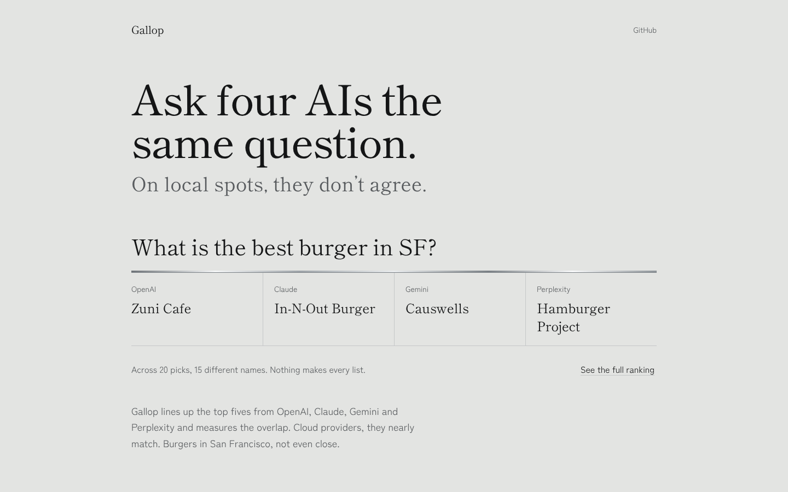

# Gallop

Ask four AIs the same question and they don't agree. Gallop puts OpenAI, Claude, Gemini and Perplexity side by side on the same questions, keeps each one's top five, and shows where they overlap, where they split, and how often they change their minds.

Live at [gallop-ai.vercel.app](https://gallop-ai.vercel.app).



## Stack

Next.js 16 (App Router), React 19, TypeScript, Tailwind CSS 4, zod. Fully static, deployed on Vercel. No database, no client data fetching, no API keys.

## How it works

- **Snapshots are the source of truth.** Each model's answers live in `data/<model>.json`, one top five per question per month. At build time `lib/snapshots.ts` validates every file with zod, checks the four models cover the same questions and months, and fails the build if they don't.
- **Agreement is measured, not eyeballed.** For each question, Gallop takes the latest top five from each model and averages the overlap (Jaccard) across all six model pairs. Same five in any order is 1, nothing shared is 0. The home page sorts questions from least to most agreement.
- **Spelling variants are merged first.** Models write "Blue Bottle" and "Blue Bottle Coffee" for the same place. A small alias table in `content.ts` maps variants to one name so overlap isn't understated. It's explicit and reviewable rather than fuzzy matching.
- **Change is computed per month.** A month counts as a change when the normalized top five differs from the month before. That's what drives the tick strips and the "Show each change" lists.
- **All the analysis is pure functions** in `lib/analysis.ts`, tested with Node's built-in test runner against hand-counted cases.
- **Every page is prerendered.** Question pages come from `generateStaticParams` with `dynamicParams = false`, so unknown ids 404 instead of rendering on demand. The only JavaScript the browser runs is Next's own.
- **Security headers** (CSP, HSTS, frame denial, nosniff, referrer and permissions policies) are set in `next.config.ts`. Production source maps are off.

## Environment variables

None. The site builds and runs from the committed snapshots.

## Run locally

Requires Node 24.

```bash
npm ci
npm run dev        # http://localhost:3000
npm test           # analysis tests
npm run lint
npm run typecheck
npm run build
```

## Project layout

```
app/              pages, layout, Open Graph image, icon
components/       agreement meter
content.ts        all site copy, links and name aliases
data/             model snapshots, one file per model
lib/analysis.ts   overlap, rank grid, change detection (pure, tested)
lib/snapshots.ts  loads and validates data at build time
```

## License

MIT
